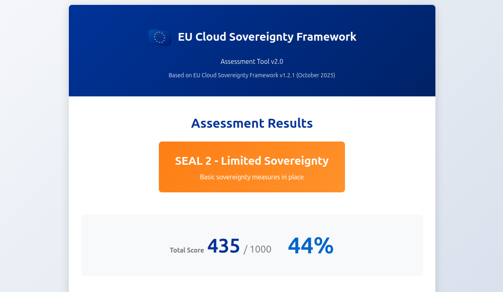

# EU Cloud Sovereignty Assessment Tool

A web-based assessment tool that evaluates cloud services and infrastructure against the **European Commission's Cloud Sovereignty Framework**, following the **official scoring methodology** published in the [Implementation Guidance and Sovereignty Assessment Calculator (1 June 2026)](https://commission.europa.eu/news-and-media/news/sovereign-cloud-framework-explained-2026-06-01_en).

[](https://opensource.org/licenses/MIT)
[](https://commission.europa.eu/document/download/09579818-64a6-4dd5-9577-446ab6219113_en)
[](https://flavienbwk.github.io/cloud-sovereignty-score/)

<div align="center">

### [🚀 Launch Web Assessment Tool](https://flavienbwk.github.io/cloud-sovereignty-score/)



</div>

## Overview

This tool helps organizations assess a cloud service's sovereignty posture through an interactive questionnaire covering the **8 sovereignty objectives** and **48 assessment criteria** of the framework. It produces the two outputs of the official calculator:

- a **Sovereignty Score** — the weighted average of the eight objective scores, and
- a **SEAL level** (Sovereignty Effective Assurance Level) — a **weakest-link** rating on a **0–4** scale.

### What is Cloud Sovereignty?

Cloud sovereignty refers to the ability of organizations and governments to maintain control over their data, infrastructure, and digital operations within their legal and jurisdictional boundaries. The EU Cloud Sovereignty Framework establishes criteria for assessing whether cloud services align with European laws, values, and strategic interests.

> **Relationship to the official framework.** The eight Sovereignty Objectives and their descriptions are those of the framework (v1.2.1, October 2025). The **scoring methodology** implemented here — the criteria, answer ladders, point values, SEAL mappings, weights, and the weakest-link SEAL calculation — is taken from the official Implementation Guidance and the *Annex – Sovereignty assessment calculator* published on 1 June 2026.

## Scoring Methodology

The tool reproduces the two computations of the official calculator.

### 1. Sovereignty Score (weighted average)

Each of the 48 criteria offers an ordinal ladder of answers. Each answer carries a **point value**. An objective's score is the sum of its selected answer values (each objective is scored on a ~1000-point scale). The overall Sovereignty Score is the weighted average of the eight objective scores:

```
Sovereignty Score = Σ ( weightᵢ × objectiveScoreᵢ ) / 1000
```

### 2. SEAL level (weakest link)

Each answer is **also** mapped to a SEAL level (0–4). The overall SEAL is the **lowest** SEAL level obtained on **any single criterion**:

```
SEAL = MIN( SEAL of every answered criterion )
```

This is the key characteristic of the framework: **a high Sovereignty Score does not guarantee a high SEAL.** A single non-sovereign criterion (e.g. data that can be compelled by a non-EU authority) caps the SEAL regardless of how strong every other answer is.

> **Note.** The point values are the reference figures from the official calculator, which contracting authorities are explicitly allowed to **adapt**. The "score" column in the official spreadsheet is illustrative; the reusable data is the answer→value and answer→SEAL mapping, both captured in `questions.js`.

## SEAL Levels

The framework defines five cumulative levels, from SEAL-0 (none) to SEAL-4 (full):

| Level      | Name                       | Meaning                                                                                                   |
| ---------- | -------------------------- | -------------------------------------------------------------------------------------------------------- |
| **SEAL-0** | No Sovereignty             | Service, technology or operations under exclusive control of non-EU third parties, governed entirely by non-EU jurisdictions. |
| **SEAL-1** | Jurisdictional Sovereignty | EU law formally applies with limited practical enforceability; still under exclusive control of non-EU third parties.          |
| **SEAL-2** | Data Sovereignty           | EU jurisdictions apply, with material dependencies remaining; under indirect control of non-EU third parties.                  |
| **SEAL-3** | Technological Sovereignty  | EU jurisdictions apply, EU actors exercising meaningful but not full influence; under marginal control of non-EU third parties. |
| **SEAL-4** | Full Digital Sovereignty   | Technology and operations under complete EU control, subject only to EU jurisdiction, with no critical non-EU dependencies.     |

In public procurement, the contracting authority sets a **minimum required SEAL**; the Sovereignty Score is then used to compare offers that meet it.

## The 8 Sovereignty Objectives

| Objective                                    | Weight | Criteria | Description                                          |
| -------------------------------------------- | ------ | -------- | ---------------------------------------------------- |
| **SOV-1** Strategic Sovereignty              | 20%    | 8        | Corporate control, governance, EU anchoring          |
| **SOV-2** Legal & Jurisdictional Sovereignty | 10%    | 6        | Legal exposure, extraterritorial laws, IP            |
| **SOV-3** Data & AI Sovereignty              | 10%    | 5        | Data location, encryption control, AI autonomy       |
| **SOV-4** Operational Sovereignty            | 15%    | 6        | Personnel, support, portability, know-how            |
| **SOV-5** Supply Chain Sovereignty           | 10%    | 7        | Hardware/software origin, vendor transparency        |
| **SOV-6** Technology Sovereignty             | 15%    | 5        | Open standards, open source, interoperability, HPC   |
| **SOV-7** Security & Compliance Sovereignty  | 15%    | 7        | Certifications, EU SOC, auditability, patching       |
| **SOV-8** Environmental Sustainability       | 5%     | 4        | Energy efficiency, circularity, EU energy sourcing   |

> **Note**: Strategic Sovereignty (SOV-1) carries the highest weight at 20%. Weights sum to 100%.

## How to Use

1. Visit the [web assessment tool](https://flavienbwk.github.io/cloud-sovereignty-score/)
2. Click "Begin Assessment"
3. Answer all 48 criteria across the 8 objectives
4. Review your **Sovereignty Score** and **SEAL level**, the per-objective breakdown, and the binding criteria
5. Download your assessment report

### Assessment Duration

- **Estimated time**: 10-15 minutes
- **Total criteria**: 48
- **Answer types**: Ordinal multiple-choice ladders (4–5 levels each)

## Display Your SEAL Level

After completing your assessment, showcase your result with these badges:

### SEAL-4 — Full Digital Sovereignty

```markdown
[](https://github.com/flavienbwk/cloud-sovereignty-score)
```

[](https://github.com/flavienbwk/cloud-sovereignty-score)

### SEAL-3 — Technological Sovereignty

```markdown
[](https://github.com/flavienbwk/cloud-sovereignty-score)
```

[](https://github.com/flavienbwk/cloud-sovereignty-score)

### SEAL-2 — Data Sovereignty

```markdown
[](https://github.com/flavienbwk/cloud-sovereignty-score)
```

[](https://github.com/flavienbwk/cloud-sovereignty-score)

### SEAL-1 — Jurisdictional Sovereignty

```markdown
[](https://github.com/flavienbwk/cloud-sovereignty-score)
```

[](https://github.com/flavienbwk/cloud-sovereignty-score)

### SEAL-0 — No Sovereignty

```markdown
[](https://github.com/flavienbwk/cloud-sovereignty-score)
```

[](https://github.com/flavienbwk/cloud-sovereignty-score)

## Use Cases

### For Organizations

- **Cloud Migration Planning** - Assess sovereignty implications before migrating
- **Vendor Selection** - Evaluate potential cloud vendors against EU sovereignty standards
- **Compliance Audits** - Document sovereignty posture for regulators and stakeholders
- **Risk Assessment** - Identify the criteria that cap your SEAL (the binding constraints)
- **Procurement Requirements** - Generate requirements for RFPs and vendor contracts

### For Cloud Service Providers

- **Self-Assessment** - Evaluate your service's Sovereignty Score and SEAL level
- **Competitive Positioning** - Demonstrate sovereignty to EU customers
- **Service Improvement** - Identify the weakest-link criteria to prioritise

### For Public Sector

- **Procurement** - Set a minimum required SEAL and compare offers by Sovereignty Score
- **Policy Compliance** - Align IT infrastructure with EU digital sovereignty policies

## Features

- **Web-Based Interface** - Modern, responsive, runs entirely in the browser
- **48 Official Criteria** - Transcribed from the official assessment calculator
- **Two Official Outputs** - Weighted Sovereignty Score **and** weakest-link SEAL (0–4)
- **Per-Objective Breakdown** - Score and SEAL for each of the 8 objectives
- **Binding-Criteria Guidance** - Highlights exactly which criteria cap your SEAL
- **Downloadable Report** - Timestamped text report
- **Data-Driven** - All criteria, values and SEAL mappings live in `questions.js`

## Customization

All content lives in `questions.js`; the engine lives in `app.js`.

### Question/answer structure

```javascript
{
    id: "sov-3-q1",
    number: 1,
    text: "Customer control over encryption keys",
    answers: [
        { label: "1. Provider only",                          value: 0,   seal: 0 },
        { label: "2. Primarily the provider but not exclusively", value: 50,  seal: 1 },
        { label: "3. Shared - provider has override keys",    value: 100, seal: 2 },
        { label: "4. Customer primary, provider can read some data", value: 150, seal: 3 },
        { label: "5. Customer exclusive - provider cannot read", value: 200, seal: 4 }
    ]
}
```

- `value` feeds the weighted **Sovereignty Score**.
- `seal` feeds the weakest-link **SEAL** computation.

### Adjusting weights or values

Edit an objective's `weight` (a fraction summing to 1 across the eight objectives), or adjust individual answer `value`/`seal` fields — the official guidance explicitly allows contracting authorities to adapt the reference values. No threshold tables are involved: the SEAL is always the minimum across answered criteria.

## Framework Reference

This tool is based on the official **EU Cloud Sovereignty Framework** and its **Implementation Guidance** (1 June 2026).

### Official Documentation

- [Sovereign Cloud Framework explained (1 June 2026)](https://commission.europa.eu/news-and-media/news/sovereign-cloud-framework-explained-2026-06-01_en)
- [Cloud Sovereignty Framework (PDF)](https://commission.europa.eu/document/download/09579818-64a6-4dd5-9577-446ab6219113_en)
- [Tender opportunities — Cloud Sovereignty Framework](https://commission.europa.eu/funding-and-tenders/find-calls-tender/tender-opportunities-department/tender-opportunities-digital-services_en)

### Related EU Regulations

- **GDPR** - General Data Protection Regulation
- **NIS2 Directive** - Network and Information Security
- **DORA** - Digital Operational Resilience Act
- **Cyber Resilience Act** - Cybersecurity requirements for digital products
- **EU Green Deal** - Environmental sustainability objectives

## Best Practices

### Before Assessment

- **Gather Documentation** - Infrastructure, vendor, and supply-chain information
- **Involve Key Stakeholders** - Legal, IT, security, and procurement teams
- **Assess All Technical Layers** - Compute, storage, network, security, IAM, critical PaaS, and the sub-contractor/supplier chain behind them

### During Assessment

- **Be Honest** - Accurate responses yield actionable results
- **Pick the Closest Ladder Step** - Each criterion is an ordinal scale; choose the level that best matches reality
- **Watch the Weakest Link** - One non-sovereign criterion sets your SEAL

### After Assessment

- **Fix Binding Criteria First** - To raise the SEAL, improve every criterion currently at the lowest level
- **Then Raise the Score** - Target low-scoring, high-weight objectives
- **Reassess Regularly** - After major architecture, vendor, or contract changes

## Roadmap

### Possible Future Features

- [ ] JSON/CSV export for reports
- [ ] Multi-language support (FR, DE, ES, IT)
- [ ] PDF report generation with charts
- [ ] Save and resume assessments
- [ ] Comparison of multiple assessments over time
- [ ] Configurable per-criterion values/weights for contracting authorities

### Version History

- **v3.0.0** (Current) - Aligned with the official Implementation Guidance & calculator (1 June 2026): 48 official criteria, corrected objective weights, dual output (Sovereignty Score + weakest-link SEAL 0–4)
- **v2.1.0** - Web-based interface with GitHub Pages deployment
- **v2.0.0** - YAML-based configuration system
- **v1.0.0** - Initial release

## Contributing

Contributions are welcome! Useful areas:

- Refinements to answer wording (two intermediate labels in SOV-1 criterion 6 were left blank in the official calculator and are filled here editorially)
- Translations to EU languages
- Output format improvements (JSON/CSV/PDF)
- Documentation enhancements

## Security Considerations

- **No Data Transmission** - All assessment data stays in your browser
- **No Internet Required** - The tool works completely offline once loaded
- **No Logging** - Responses are not logged or transmitted
- Review generated reports before sharing, and redact sensitive details if needed

## License

This project is licensed under the MIT License - see the [LICENSE](LICENSE) file for details.

## Disclaimer

This tool is provided for informational and self-assessment purposes only. It does not constitute:

- Legal advice or compliance certification
- Official EU endorsement or certification
- A guarantee of regulatory compliance or a substitute for professional consultation

Point values are reference figures that contracting authorities may adapt. Organizations should consult legal and technical experts for official compliance verification.

## Support

- **Issues**: [GitHub Issues](https://github.com/flavienbwk/cloud-sovereignty-score/issues)
- **Discussions**: [GitHub Discussions](https://github.com/flavienbwk/cloud-sovereignty-score/discussions)

## Acknowledgments

- European Commission for the Cloud Sovereignty Framework and its Implementation Guidance
- Contributors to EU digital sovereignty initiatives
- The open source community

---

## Quick Reference Card

```txt
╔══════════════════════════════════════════════════════════╗
║            SOVEREIGNTY ASSESSMENT QUICK REFERENCE        ║
╠══════════════════════════════════════════════════════════╣
║ Criteria:   48   |   Objectives: 8   |   ~10-15 minutes  ║
╟──────────────────────────────────────────────────────────╢
║ TWO OUTPUTS:                                             ║
║  • Sovereignty Score = weighted average of objectives    ║
║  • SEAL (0-4)        = MINIMUM across all criteria        ║
║    → one weak criterion caps your SEAL                   ║
╟──────────────────────────────────────────────────────────╢
║ WEIGHTS:  SOV-1 20% · SOV-4 15% · SOV-6 15% · SOV-7 15%  ║
║           SOV-2 10% · SOV-3 10% · SOV-5 10% · SOV-8  5%  ║
╟──────────────────────────────────────────────────────────╢
║ SEAL: 0 None · 1 Jurisdictional · 2 Data ·               ║
║       3 Technological · 4 Full Digital                   ║
╚══════════════════════════════════════════════════════════╝
```
